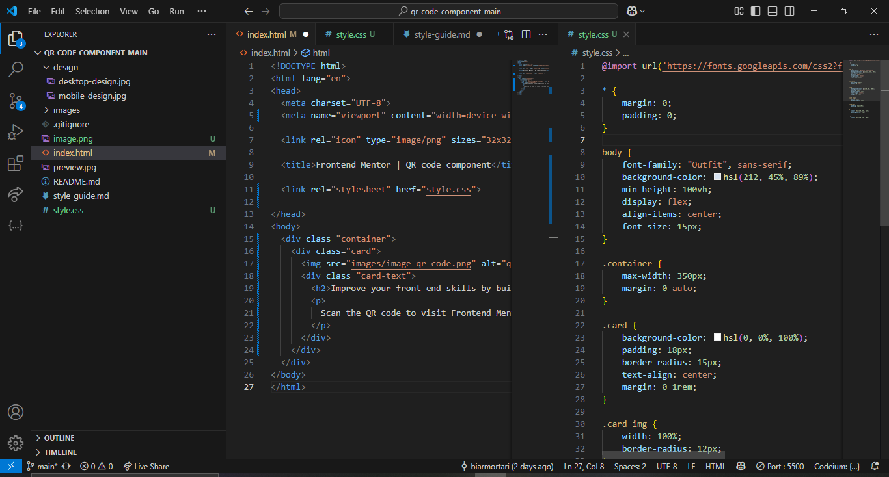

# Frontend Mentor - QR code component
Esta é a minha solução para o desafio QR Code Component no Frontend Mentor.

Visão Geral

Screenshot

URL da solução: https://github.com/biarmortari/QR-code-component
URL do site ao vivo: http://127.0.0.1:5500/index.html

Meu Processo

Tecnologias Utilizadas

HTML5 semântico

CSS3

Flexbox

Mobile-first workflow

O que aprendi

Neste desafio, aprendi a estruturar um componente de forma responsiva utilizando Flexbox e a trabalhar melhor com tipografia e espaçamento no CSS. Também pratiquei o uso de cores e bordas arredondadas para criar um design limpo e moderno.

Desenvolvimento Contínuo

Quero continuar aprimorando minhas habilidades em CSS Grid e acessibilidade em futuros projetos. Também pretendo explorar mais sobre boas práticas de design responsivo.

Autor

Frontend Mentor - @biarmortari

LinkedIn - Beatriz Rodrigues Mortari

